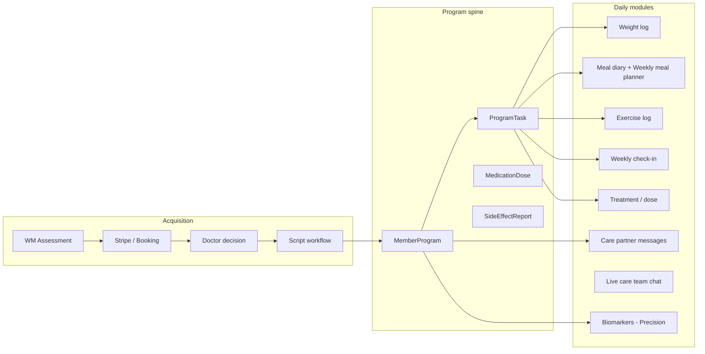

# Weight Management Program — Role Workflows

This document describes end-to-end workflows for **Weight Management (WM) only**. Men's Health, Women's Health, GP clinic programs, and other `ProgramMember.program` values are unchanged.

---

## System map (building blocks)

| Building block | Patient route | API / lib |
|----------------|---------------|-----------|
| Portal gating | All WM routes | `portal-context.ts`, `WeightManagementPortalShell` |
| Today's program | WM Home | `GET /api/program/today` |
| Weekly meal planner | `/dashboard/weight-management/meal-plan` | `GET/POST /api/weight-management/meal-plan` + localStorage |
| Dose + side effects | Treatment | `PATCH /api/program/doses/[id]`, `/api/program/side-effects` |
| Care partner messages | `/dashboard/messages` | `/api/patient/messages` + `ensureWMProgramMember` |
| Weekly AI insight | WM Home card | `GET /api/program/insight`, cron weekly |
| Admin migration | Admin → Weight | `/api/admin/weight-management/program-migration` |
| Care inbox | Admin → Weight → Care inbox | `/api/admin/weight-management/care-inbox` |

---

## 1. Patient workflow

### Phase A — Before program is active (pre-tracking)

1. Complete **WM assessment** and pay (Stripe / booking confirm).
2. **Journey timeline** on WM Home shows: consultation → approval → script → pharmacy → delivery.
3. **Portal gating**: Progress, track weight, goals, check-in are locked until `ONBOARDING_COMPLETE` or `ACTIVE` (`portal-context.ts`).
4. **Meal planner** and **Learn** remain available for engagement (`mealPlanning` feature).
5. **Post-checkout**: Thank-you + magic link → `?onboarding=post-checkout` welcome banner.
6. Optional **OnboardingFlow** (weight goal, preferences).

### Phase B — Activation (script written → delivered)

1. Admin sets script to **SCRIPT_WRITTEN** → automatically:
   - `MemberProgram` created (Core or Precision playbook from intake).
   - Dose schedule + 14 days of tasks generated.
   - `ProgramMember` bridged for messaging.
   - WM intake `portalStatus` synced.
2. Patient may run **Admin → Program migration** if they enrolled before automation existed.

### Phase C — Active program (daily loop)

**Morning (optional push/email via cron)**

- Cron `program-daily` sends reminders for pending tasks (if `trackingReminders` on).

**WM Home — “Today’s program”**

| Task | Patient action | Completes when |
|------|----------------|----------------|
| Log weight | Track weight page | Weight POST |
| Log meals | Meal diary **or** meals planned today in **weekly meal planner** | Meal POST or planner save with today’s meals |
| Log exercise | Exercise page | Exercise POST |
| Medication dose | Treatment → Log dose | Dose PATCH |
| Side effect check-in | Treatment or “Report side effects” | Side effect POST or “none” skip |
| Weekly check-in | Sunday — Check-in page | Check-in POST |
| Review biomarkers | Sunday — Precision only | Opens biomarkers (task manual complete via visit) |

**Weekly meal planner** (existing UI, now server-backed)

- Plan the week by slot (breakfast/lunch/dinner/snack).
- Saves to DB per week (`WmMealPlanWeek`) and localStorage.
- Does not replace meal **diary** — planner is the plan; diary is what you ate.

**Side effects**

1. After dose (or anytime): select symptoms + severity.
2. **Mild**: mitigation tips shown in-app.
3. **Severe** or **abdominal pain**: care team notified (`CareCommunication` SIDE_EFFECT_REVIEW).
4. **Two moderate+ in 48h**: recurring review task for care partner.

**Messages**

- `/dashboard/messages` — async thread with care partner (auto-provisioned `ProgramMember` for WM users only).

**Live chat**

- Care Team tab / support — AI or human; WM members get **program context** in AI replies (weight trend, adherence, no dose changes).

**Precision only**

- Biomarker strip on home when labs out of range.
- Sunday biomarker review task + ~90-day lab cadence task.
- Weekly insight may reference biomarker focus.

**Weekly**

- Sunday: check-in + (Precision) biomarker review.
- **This week** card: Claude insight (cron or “Generate weekly insight”).
- Phase auto-advances: Induction (wk 0–1) → Titration (2–7) → Maintenance (8+).

### Phase D — Plateau / adherence

- No weight change across 4 logs → notification + `WEIGHT_PLATEAU` care task.
- Low adherence visible on today’s progress bar.

---

## 2. Care partner workflow

### Access

- **Admin → Weight → Care inbox** (ADMIN sees all; CARE_PARTNER role sees assigned patients only via `assignedCarePartnerId`).
- **CRM customer page** for deep detail.
- **Messages** via `ProgramMember` / `MemberMessage` (staff `CarePartner` record synced from staff User email).

### Daily inbox review

1. Filter **Needs attention** (default).
2. For each member card:
   - **Today adherence %** (program tasks done today).
   - **Open side effect reports**.
   - **Pending care tasks** (side effect, biomarker, plateau).
   - **Weekly focus** from last AI summary.
3. Click through to CRM → message patient or complete `CareCommunication` task.

### Task types created by system

| Type | Trigger |
|------|---------|
| `SIDE_EFFECT_REVIEW` | Severe / urgent symptoms or recurring moderate |
| `BIOMARKER_REVIEW` | Precision: high HbA1c, high ALT, etc. |
| `WEIGHT_PLATEAU` | 4 weight logs with &lt;0.3 kg change |
| Existing triage/onboarding | Unchanged from prior CRM flows |

### Messaging

- Reply via your care tooling that uses `MemberMessage` (same as GP program infrastructure, but only WM patients get auto-bridged `ProgramMember` with `program = weight_management`).

### What care partners should not do in portal

- Change prescriptions (doctor/admin scripts workflow only).
- Change dose schedule (generated from prescription; patient logs taken/skipped).

---

## 3. Doctor workflow

### Consultation → approval

1. Patient appears in **doctor queue** / triage (existing).
2. **Doctor decision** → APPROVED creates prescription (draft), subscription, care tasks (existing).
3. Patient email: neutral “consultation complete” (TGA-safe, no product claims).

### Script finalization (often admin/pharmacy ops)

1. **Admin → Prescriptions** → advance status:
   - `SCRIPT_WRITTEN` → starts **MemberProgram**, syncs journey + intake, bridges messaging.
   - Through pharmacy → `DELIVERED` / patient `ACTIVE`.
2. Journey + `WeightManagementIntake.portalStatus` kept in sync via `journey-sync.ts` (WM only).

### Follow-up

- **Follow-up date** on prescription (existing).
- Precision patients: review **BIOMARKER_REVIEW** tasks when labs flagged.
- Does not use WM “Today’s program” UI — doctor stays in admin/doctor portals.

### Clinical boundaries

- AI (chat + weekly insight) never changes doses; escalates to clinician/care partner.
- Side effect **severe** → patient told to call 000 if emergency; care task for partner within hours.

---

## 4. Admin workflow

### Weight Management hub (`/admin/weight-management`)

| Action | Where |
|--------|--------|
| View member list + program phase/tier | Member Progress (API fixed) |
| Patient approvals | Approvals |
| **Program migration** | Card on hub — preview / run for legacy members |
| **Care inbox** | Care inbox link |
| Coaching messages | Legacy coaching route |
| Cron health | `GET /api/admin/weight-management/cron-health` |

### Program migration (one-time / ongoing)

1. **Preview migration** — counts create / upgrade / sync.
2. **Run migration** — eligible WM prescriptions → Core/Precision playbook, tasks, messaging bridge.
3. Safe for other programs: only WM prescriptions / tier detection.

### Script / pharmacy pipeline

- Unchanged UI; now triggers program start + journey sync on `SCRIPT_WRITTEN`.

### Cron monitoring

Ensure in production:

- `CRON_SECRET` set on Vercel.
- `vercel.json` crons: `program-daily`, `program-weekly-insights`, `churn-scoring`.
- Check **cron-health** API for `program_daily_reminder` and `weekly_program_insight` logs.

### Precision vs Core

| | Core | Precision |
|---|------|-----------|
| Playbook | `wm_core_v1` | `wm_precision_v1` |
| Side effect monitoring | 14 days | 21 days |
| Sunday tasks | Check-in | Check-in + biomarker review |
| Biomarker automation | No | Flags + escalations + 90d lab task |

---

## 5. Visual / UX standards (WM)

- **Today's program**: emerald gradient card, progress bar, overdue badges.
- **Precision**: violet badges + biomarker strip.
- **Treatment / dose**: violet medication card.
- **Side effects**: mitigation cards (amber highlight for high-priority tips).
- **Weekly insight**: “This week” block with bullets + focus line.
- Pre-active journey: unchanged timeline UX (no program card until eligible).

---

## 6. What was explicitly not changed

- Men's / Women's / metabolic marketing and dashboards.
- `ProgramMember` records for `program !== weight_management` (GP clinic, etc.).
- Public assessment funnel structure.
- Doctor decision clinical logic and TGA email copy.
- Existing **weekly meal planner UI** — only added server persistence; layout and recipe picker unchanged.

---

## 7. Quick test checklist

| Role | Test |
|------|------|
| Admin | Preview + run migration; open Care inbox |
| Patient | Today’s program tasks; meal planner saves after refresh; dose + side effect; messages |
| Care partner | Inbox shows adherence; CRM link works |
| Doctor | Script → SCRIPT_WRITTEN → patient gets program (or migration) |
| Cron | `curl -H "Authorization: Bearer $CRON_SECRET" localhost:3000/api/cron/program-daily` |

---

*Last updated: implementation of Phases A–D (program orchestrator, WM-only guards via `isWeightManagementUser`).*
